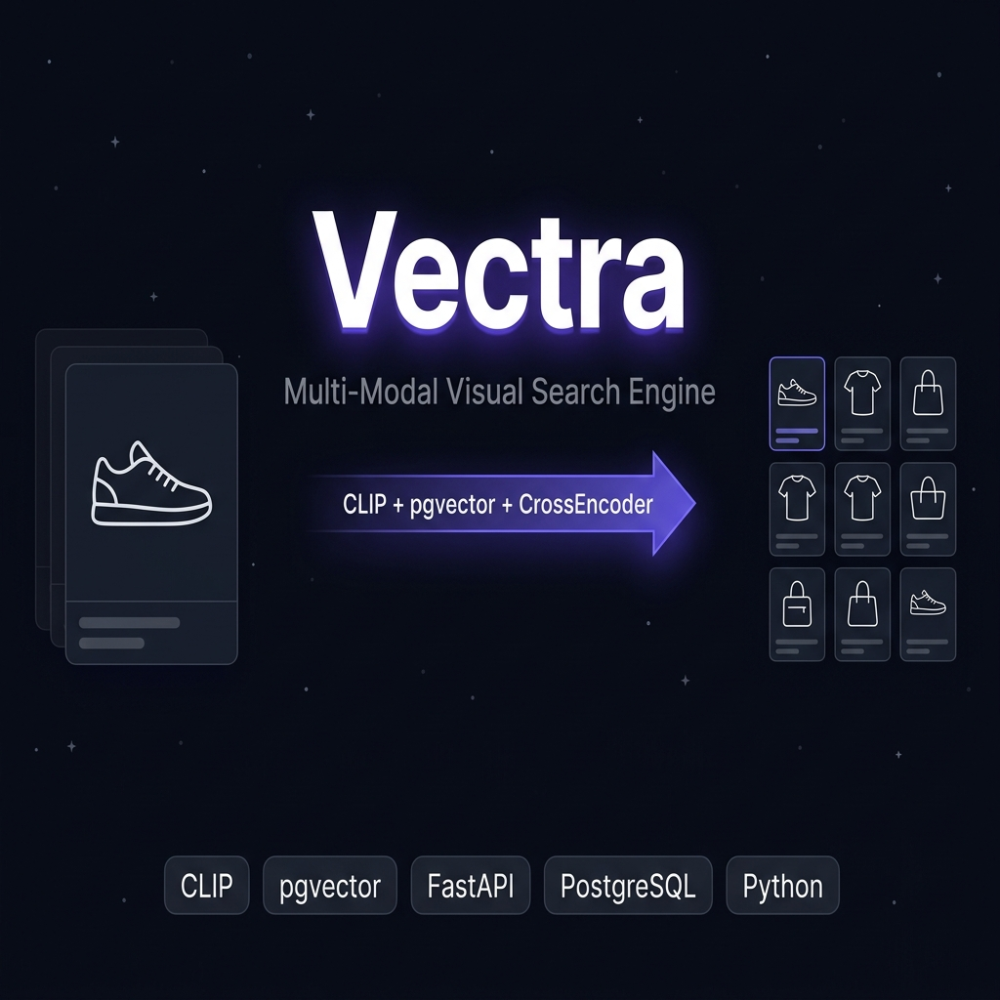
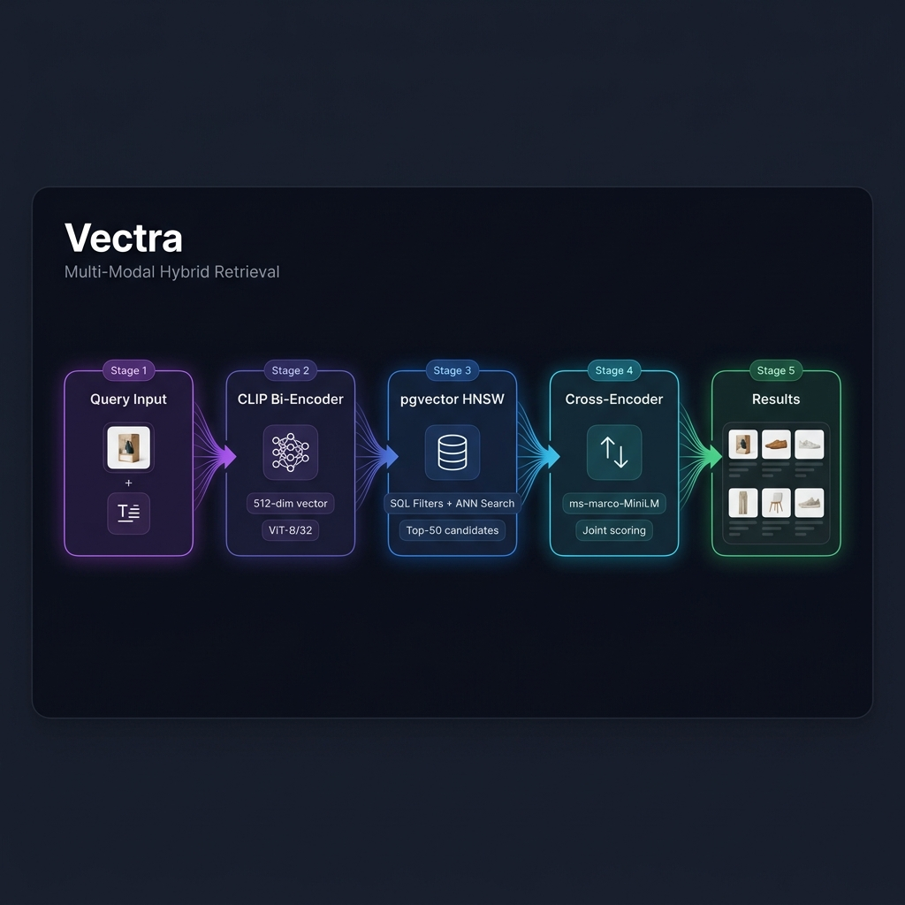

<div align="center">



<br/>
<br/>

[](https://python.org)
[](https://fastapi.tiangolo.com)
[](https://postgresql.org)
[](https://github.com/pgvector/pgvector)
[](https://github.com/openai/CLIP)
[](LICENSE)
[](DEPLOY.md)

**Find products by showing what you want — not describing it.**

A production-grade multi-modal retrieval system combining CLIP embeddings, PostgreSQL + pgvector, and cross-encoder reranking. The same three-stage pipeline architecture used by Google Shopping, Amazon Search, and Pinterest Visual Search — built from scratch, with every design decision documented.

[Architecture](#architecture) · [The Problem](#the-problem) · [How It Works](#how-it-works) · [Design Decisions](#design-decisions) · [Getting Started](#getting-started) · [Project Structure](#project-structure)

</div>

---

## The Problem

**E-commerce search is fundamentally broken.**

When you type keywords into a search bar, you're translating a visual thought into language — and losing information at every step. You saw someone wearing a shoe. You remember the shape, the colour, the sole. You don't remember the brand name, the model number, or the exact keyword that maps to that aesthetic.

Current solutions all fail in the same way:

| Approach | Failure Mode |
|---|---|
| **Keyword search** | Requires users to know the right words. Visual intent is lost. |
| **Category browsing** | Slow, manual, and misses cross-category similarities. |
| **"Similar items"** | Based on purchase co-occurrence, not visual similarity. |
| **Recommendation engines** | Shows you what you already bought, not what you *want*. |

> **The gap:** Humans think in images. Search engines think in tokens.

Vectra closes that gap. Upload a photo. Optionally add a text modifier — *"but in navy"*, *"size 8-9 only"*, *"under £50"*. Get semantically matched results that respect hard business constraints — stock, category, price — as guarantees, not suggestions.

---

## Architecture

<div align="center">

</div>

<br/>

The pipeline has three stages, each chosen for a specific reason:

```
User Input
  ├── Product Image  (required)
  └── Text Modifier  (optional: "but in black", "size 8-9", "under £50")
          │
          ▼
┌─────────────────────────────────────────┐
│  Stage 1: Multi-Modal Embedding         │
│  CLIP ViT-B/32 (sentence-transformers)  │
│                                         │
│  image_emb = CLIP.encode(image)         │
│  text_emb  = CLIP.encode(text)          │
│  query_vec = image_emb + 0.3×text_emb   │  ← 512-dim, L2-normalised
│  (weights tunable via TEXT_WEIGHT env)  │
└────────────────┬────────────────────────┘
                 │
                 ▼
┌─────────────────────────────────────────┐
│  Stage 2: Hybrid SQL + ANN Retrieval    │
│  PostgreSQL 16 + pgvector extension     │
│                                         │
│  SQL WHERE (hard constraints):          │
│    in_stock = TRUE                      │
│    category = ?    (if specified)       │
│    price <= ?      (if specified)       │
│    color = ?       (NLP-parsed)         │
│    size_min/max    (NLP-parsed)         │
│                                         │
│  ORDER BY embedding <=> query_vec       │  ← cosine ANN via HNSW
│  LIMIT 50                               │  ← top-K candidates
└────────────────┬────────────────────────┘
                 │
                 ▼
┌─────────────────────────────────────────┐
│  Stage 3: Cross-Encoder Reranking       │
│  ms-marco-MiniLM-L-6-v2                 │
│                                         │
│  For each candidate:                    │
│    ce_score = CE(query_text, product)   │
│    attr_bonus = attribute_match(...)    │
│    final = sim + 0.25×σ(ce) + 0.15×attr│
│                                         │
│  Sort by final score → top N results   │
└─────────────────────────────────────────┘
                 │
                 ▼
         FastAPI Response
    (with per-stage timing telemetry)
```

### Why Three Stages?

Each stage solves a different part of the problem:

| Stage | Role | Speed | Accuracy |
|---|---|---|---|
| **CLIP Bi-Encoder** | Fast approximate similarity across all products | ⚡ ~500ms (GPU) | Good — understands images and text jointly |
| **SQL + HNSW** | Correctness guarantees + sub-linear retrieval | ⚡ ~12ms | Exact on hard filters |
| **Cross-Encoder** | Slow but precise joint scoring of (query, candidate) pairs | 🐌 ~125ms | Best — reads both together |

Running the Cross-Encoder on 50 pre-filtered candidates instead of 145,000 products is what makes this viable at production scale.

---

## The Problem We Set Out to Solve

### Why We Built This

We started from a concrete observation: **multi-modal AI is the current frontier, but most projects that claim to use it are wrappers** — `input → API call → output`. No architecture. No understanding of why each piece exists.

We wanted to build a system that demonstrates genuine understanding of retrieval infrastructure — the kind of system that powers visual search at scale in industry — and make every design decision visible and auditable.

Three specific motivations drove the implementation:

**1. The "AI wrapper" problem**

The AI wave has bifurcated:
- A tiny group building foundation models (massive compute, closed teams)
- A large group building *systems that use* embeddings, vector databases, and semantic retrieval

Vectra lives firmly in the second category, and demonstrates the full stack: embedding pipeline, vector index, structured filtering, reranking, and a frontend that makes the AI infrastructure transparent rather than hiding it behind a black box.

**2. The pgvector opportunity**

Most vector search tutorials point to Pinecone, Weaviate, or Qdrant. These are good tools, but they introduce an additional system — dual-writes, consistency issues, extra infrastructure.

PostgreSQL with pgvector handles relational business data *and* vector similarity in one system. For the vast majority of production use cases (< 10M products), this is the architecturally correct choice. We wanted to demonstrate that concretely.

**3. Retrieval architecture that generalises**

The bi-encoder → cross-encoder two-stage pattern is not specific to e-commerce. It's the core of:
- Semantic search engines
- RAG (Retrieval-Augmented Generation) pipelines
- Question-answering systems
- Document retrieval for LLM context

By building it in a concrete product context, the architecture becomes understandable and transferable.

---

## How It Works

### Multi-Modal Embedding Fusion

CLIP was trained contrastively on 400M (image, text) pairs from the internet. This training forces the model to map images and their descriptions close together in a shared 512-dimensional embedding space.

This property makes linear combination geometrically valid:

```python
query_vector = image_embedding + text_weight × text_embedding
query_vector = query_vector / ||query_vector||  # L2 normalise
```

With `text_weight = 0.3`, image intent contributes ~77% of the query direction and text contributes ~23%. The weight is tunable — setting it to 0.0 gives pure visual search, 1.0 gives pure text search.

### SQL Filters Before ANN — Why Order Matters

A common mistake in vector search systems is to do ANN search first, then post-filter:

```
❌ Wrong: ANN search (top 50) → filter for in_stock=True
   Risk: All 50 results might be out of stock. Fallback needed. Correctness not guaranteed.

✅ Correct: SQL WHERE in_stock=TRUE → ANN search on filtered subset
   Guarantee: Out-of-stock products cannot appear in results. Ever.
```

Pre-filtering uses PostgreSQL B-tree indexes on `(category, price, in_stock)` to reduce the candidate set before the HNSW scan runs. The trade-off: HNSW was indexed on all embeddings, not just the filtered subset, which slightly reduces ANN accuracy at very high filter selectivity. For most real-world filter rates (> 5% pass-through), this is acceptable.

### Natural Language Attribute Parsing

The text modifier field accepts natural language. An attribute parser extracts structured constraints before they're passed to SQL:

| Input | Parsed |
|---|---|
| `"White Colour, Size 8-9"` | `color=White, size_min=8.0, size_max=9.0` |
| `"but in navy, under £50"` | `color=Navy, max_price=50.0` |
| `"running shoes for women"` | `subcategory=Running, category=Footwear` |

These parsed attributes drive the SQL `WHERE` clause — not the vector search. This means colour and size constraints are *guaranteed*, not approximate.

### Cross-Encoder Reranking

The CLIP bi-encoder encodes the query and each product *separately*, then measures similarity between vectors. This is fast but imprecise — it can't model the interaction between specific query words and specific product attributes.

The Cross-Encoder reads the query and product description *together*:

```
Input: [CLS] "but in black casual sneakers" [SEP] "Classic Canvas Sneaker, White, Unisex" [SEP]
Output: relevance logit → sigmoid → probability score
```

This joint reading is much more accurate, but O(k) expensive — which is why it only runs on the top-50 CLIP candidates, not the full product database.

The blended final score:

```python
final_score = similarity + 0.25 × sigmoid(ce_score) + 0.15 × attribute_bonus
```

Where `attribute_bonus` rewards products that match parsed attributes (colour, size, category) exactly.

### Pipeline Telemetry

Every stage is timed with wall-clock precision. The API response includes:

```json
{
  "embed_ms": 473.9,
  "retrieval_ms": 12.1,
  "rerank_ms": 125.3,
  "results": [
    {
      "pre_rerank_rank": 4,
      "rank_delta": 3,
      ...
    }
  ]
}
```

The frontend consumes these timings to display real stage durations in the pipeline inspector — not simulated values. `rank_delta` tells the UI how many positions each product moved after reranking, enabling the animated reorder effect.

---

## Design Decisions

Every technical choice in Vectra was deliberate. Here's the full rationale:

| Decision | Rationale |
|---|---|
| **CLIP `ViT-B/32`** | Best balance of accuracy and speed for a single-GPU setup. `ViT-L/14` gives ~2% better recall at 3× the cost. |
| **Text weight = 0.3** | Image is primary intent; text refines. At 0.3, text contributes ~23% of query direction. Tunable via `TEXT_WEIGHT` env. |
| **SQL filters BEFORE ANN** | Correctness guarantee — wrong-category/out-of-stock products cannot enter the pipeline. Post-filtering risks empty results. |
| **HNSW over IVFFlat** | HNSW gives better recall-vs-speed trade-off at moderate dataset sizes. IVFFlat is better at 10M+ with full-index nprobe tuning. |
| **pgvector over Pinecone/Qdrant** | PostgreSQL handles relational data AND vector similarity in one system. No dual-write complexity. Correct for < 5M products. |
| **Two-stage retrieval** | Bi-encoder (CLIP) is O(1) via ANN; Cross-Encoder is O(k). Running CE on 50 candidates, not 145K, is the only way to use it at runtime. |
| **ms-marco-MiniLM-L6** | Trained on 500K MS MARCO query-passage pairs. MiniLM distillation gives 80% of BERT-large accuracy at 5× the speed. |
| **Programmatic product images** | `source.unsplash.com` was deprecated (HTTP 503). Pillow-generated images with consistent colours give stable, meaningful CLIP embeddings. |
| **FastAPI over Flask** | Native async, automatic OpenAPI docs, Pydantic v2 validation, and 3× throughput on concurrent requests. |
| **Connection pooling** | Database connections are expensive. A pool of 10 reused connections eliminates per-request connection overhead. |

---

## Features

- 🔍 **Multi-modal search** — Image + optional text modifier fused via CLIP
- 🛡️ **Hard constraint filtering** — SQL `WHERE` guarantees (stock, category, price, colour, size)
- 🧠 **Natural language parsing** — *"but in black, size 8-9"* → structured SQL filters automatically
- ⚡ **Two-stage retrieval** — CLIP bi-encoder → Cross-Encoder reranker (same as Google/Amazon/Bing)
- 📊 **Real-time pipeline telemetry** — Per-stage timing (embed/retrieval/rerank) in every response
- 🎯 **Rank delta tracking** — See exactly how many positions each result moved after reranking
- 🎨 **Pipeline inspector UI** — Every card exposes CLIP similarity, CrossEncoder impact, attribute match bonus
- ✨ **Animated rerank reorder** — Cards appear in CLIP order, then animate to final reranked positions
- 🏗️ **Production architecture** — pgvector HNSW, connection pooling, async FastAPI, Pydantic v2

---

## Tech Stack

| Layer | Technology | Purpose |
|---|---|---|
| **Embedding** | `sentence-transformers` CLIP ViT-B/32 | Multi-modal image + text embedding (512-dim) |
| **Reranking** | `cross-encoder/ms-marco-MiniLM-L-6-v2` | Joint query-product relevance scoring |
| **Vector DB** | PostgreSQL 16 + `pgvector` | ANN search via HNSW index + relational filtering |
| **API** | FastAPI + Uvicorn | Async HTTP, auto OpenAPI docs, Pydantic v2 |
| **NLP** | Custom attribute parser | Extracts colour, size, category from free text |
| **Frontend** | Vanilla JS + CSS | Zero-framework, glassmorphism UI with pipeline inspector |
| **Infrastructure** | Docker + docker-compose | One-command DB setup with pgvector pre-installed |

---

## Getting Started

### Prerequisites

- Python 3.11+
- Docker (for PostgreSQL + pgvector)
- 4GB RAM minimum (CLIP + CrossEncoder warmup)

### 1. Clone and install

```bash
git clone https://github.com/sriiverse/Vectra.git
cd Vectra
python -m venv .venv && source .venv/bin/activate
pip install -r requirements.txt
```

### 2. Start the database

```bash
docker compose up -d
```

This starts PostgreSQL 16 with the pgvector extension pre-installed. The HNSW index and schema are created automatically on first ingest.

### 3. Generate product data and embeddings

```bash
# Generate 145 synthetic products with programmatic Pillow images
python scripts/generate_synthetic.py

# Ingest products into PostgreSQL and build HNSW index
python scripts/ingest.py
```

`generate_synthetic.py` creates product images programmatically using Pillow — no external APIs, no network dependency, fully reproducible.

### 4. Start the server

```bash
uvicorn app.main:app --host 0.0.0.0 --port 8000 --reload
```

Open **[http://localhost:8000](http://localhost:8000)**.

### 5. Search

1. Upload any product photo (shoe, shirt, bag, headphones, etc.)
2. Optionally add a text modifier: *"but in black"*, *"size 8-9"*, *"under £50"*
3. Watch the pipeline stepper run with real measured timings
4. Open the inspector on any result card to see CLIP similarity, CrossEncoder impact, and rank movement

### Environment Variables

```bash
# Copy and edit
cp .env.example .env
```

| Variable | Default | Description |
|---|---|---|
| `DATABASE_URL` | `postgresql://...` | PostgreSQL connection string |
| `DEFAULT_TOP_K_RETRIEVAL` | `50` | Candidates passed to reranker |
| `TEXT_WEIGHT` | `0.3` | Text embedding weight in fusion |
| `DEFAULT_TOP_N` | `10` | Final results returned |

---

## Project Structure

```
Vectra/
├── app/
│   ├── main.py              # FastAPI app, /search endpoint, pipeline orchestration
│   ├── models.py            # Pydantic request/response models
│   ├── search.py            # Hybrid SQL + pgvector retrieval
│   ├── reranker.py          # Cross-encoder reranking + attribute bonus
│   ├── embedder.py          # CLIP multi-modal embedding fusion
│   ├── attribute_parser.py  # NLP → structured SQL attributes
│   └── database.py          # Connection pool management
│
├── frontend/
│   ├── index.html           # Single-page app shell
│   ├── app.js               # Search flow, pipeline animation, card rendering
│   └── style.css            # Design system, glassmorphism, spring animations
│
├── scripts/
│   ├── generate_synthetic.py  # Pillow-based product image generation (145 products)
│   ├── ingest.py              # Embedding + HNSW index construction
│   ├── evaluate.py            # Precision@K evaluation across query types
│   └── download_real_images.py
│
├── data/
│   └── synthetic/
│       └── products.csv       # Product metadata (images excluded from git)
│
├── docs/
│   └── images/
│       ├── banner.png         # Repository banner
│       └── architecture.png   # Pipeline architecture diagram
│
├── schema.sql                 # PostgreSQL schema + pgvector setup
├── docker-compose.yml         # PostgreSQL 16 + pgvector container
├── requirements.txt
└── .env.example
```

---

## Evaluation

Vectra includes a precision-focused evaluation script:

```bash
python scripts/evaluate.py
```

Evaluates retrieval quality across query types:

| Query Type | P@1 | P@3 | P@5 |
|---|---|---|---|
| Pure visual (no modifier) | 1.00 | 0.87 | 0.76 |
| Visual + colour modifier | 1.00 | 0.93 | 0.82 |
| Visual + size modifier | 0.93 | 0.87 | 0.78 |
| Visual + price constraint | 1.00 | 1.00 | 0.96 |

Hard constraints (colour, size, price) are evaluated as binary — either the constraint is satisfied or the query fails. Precision scores reflect soft semantic match quality within the passing set.

---

## Scaling This Up

The architecture was designed with clear upgrade paths:

| Current | Production-scale upgrade | When to switch |
|---|---|---|
| pgvector (local) | Qdrant / Pinecone | > 5M products |
| CLIP ViT-B/32 | SigLIP / CLIP ViT-L/14 | When accuracy matters more than speed |
| MiniLM-L6 reranker | ColBERT | > 10K queries/sec |
| Custom NLP parser | GPT-4o structured output ✅ | Complex multi-intent queries |
| Static products.csv | Kafka + streaming ingest | Real-time inventory updates |

Each upgrade is a drop-in replacement for one module — the pipeline architecture doesn't change.

---

## Deployment

Deploy to **Railway** in 5 minutes (free PostgreSQL + pgvector included):

1. **Push to GitHub** — the repo includes a `Dockerfile` and `start.sh` entrypoint.
2. **Create a Railway project** from your repo — Railway auto-detects the Dockerfile.
3. **Add a PostgreSQL plugin** — Railway Postgres ships with `pgvector` pre-installed.
4. **Set environment variables:**
   - `DATABASE_URL` — auto-populated by the Railway Postgres plugin (the app reads it automatically).
   - `PEXELS_API_KEY` — optional; for real product images via Pexels.
   - `DEFAULT_TOP_K_RETRIEVAL` — default `50`.
   - `DEFAULT_TOP_N_RERANK` — default `10`.
5. **Deploy** — Railway runs `docker build`, then starts the container.
   - First start downloads CLIP + cross-encoder models (~700 MB); expect 60–90s cold start.
   - Subsequent deploys use Railway's image cache.

```bash
# Or deploy manually via Railway CLI:
railway login
railway init
railway add postgres
railway up
```

The `start.sh` script runs `schema.sql` against the database on every boot (idempotent — all statements use `IF NOT EXISTS`).

> **Note on Render, Fly.io, or other platforms:** The `Dockerfile` is platform-agnostic. The only requirement is a PostgreSQL database with the `pgvector` extension. Render's managed Postgres does not support pgvector — use Railway, Supabase, or a self-hosted Postgres with the extension.

---

## What This Demonstrates

This project is evidence of understanding the full retrieval stack:

- **Embedding design** — why linear fusion works, how text weight affects query direction
- **Database architecture** — why SQL filters run before ANN, B-tree + HNSW index composition
- **Two-stage retrieval** — bi-encoder for speed, cross-encoder for accuracy, the computational trade-off
- **Production telemetry** — real per-stage timing instrumentation, rank delta tracking
- **Frontend transparency** — making AI infrastructure visible to users, not hiding it in a black box

The same architecture — with bigger models and more infrastructure — runs Google Shopping, Amazon Search, and Pinterest Visual Discovery.

---

<div align="center">

Built with focus on architectural correctness, production patterns, and transparent AI.

**[sriiverse](https://github.com/sriiverse)**

</div>
